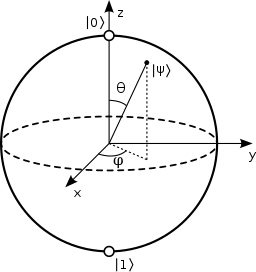
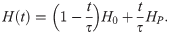
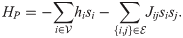

name: inverse
layout: true
class: middle, inverse

---

# A Short Introduction to Quantum Computing

## Dan Jonsson

### [UiT The Arctic University of Norway](https://uit.no)

---
layout: false

## Basic consepts

- qbit: superposition of two states

`$$ | \Psi \rangle = a | 0 \rangle + b | 1 \rangle, \; |a|^2 + |b|^2 = 1  $$`

- N-qbit state: direct product of N qbits forms a basis
- Can be represented as state vector of size `\(2^N\)`

`$$ | \Psi \rangle = \sum a_x | x \rangle, \; \sum |a_x|^2  = 1  $$`

- Quantum gate: performs unitary transformation of state vector

---

## How does a quantum computer operate?

- Input data encoded as state vector
- Quantum computation as a series of quantum gates (reversible)
- Output state vector
- Do measurement on state vector to get actual result (very important point)
- Final result may come with an uncertainty
- May need to repeat calculation to get improved statistics/accuracy
- No-cloning theorem: No unitary tranformation such that
`$$ |0\rangle |\Psi\rangle \rightarrow |\Psi\rangle |\Psi\rangle $$` 

---

## Speed up from

- Effective encoding of input data into state vector
- Do calculations "in parallel through superposition"
 (but this might not be so easy in practise)
- Sometimes exponential speed up compared to classical algorithms
- The number of parameters needed to specify one particular quantum
state is proportional to the number of all possible classical states
- Quantum algorithms usually look quite different from classical ones
- Example: Shor's algorithm for integer factorization
- Quantum supremacy

[The talk](https://www.smbc-comics.com/comic/the-talk-3)

---

## Physical realizations

- As of today limited to about 50 qbits
- Trapped Ions
- Optical
- NMR
- Others

---

## Challenges

- Decoherence (this is the big one)
- Typically, needs cooling to mK temp 
- Non-trivial to prepare system in arbitrary initial state
- Non-trivial to apply arbitrary unitary transformation
- Non-trivial to measure
- Expensive

---

## D-wave

- Adiabatic quantum computer: based on quantum annealing

- Minimizes an Ising-type Hamiltonian

- Array of flux qubits (superconducting, Josephson junctions)
- Physical realization with thousands of qubits
- Not universal, can't do Shor's algorithm
- Can still do integer factorization by alternative algorithms
- Can do a large class of problems that can be formulated as discrete
  optimization with constraints (binary integer linear programming)
- Traveling salesman, four colour

---

## Future of quantum computing (my predictions)

- Is useful already today
- Development is going quickly
- Probably will never replace regular computers
- You will not have one at home
- Will be available at big compute sites
- Use "QPU" as accelerator for part of your computation
